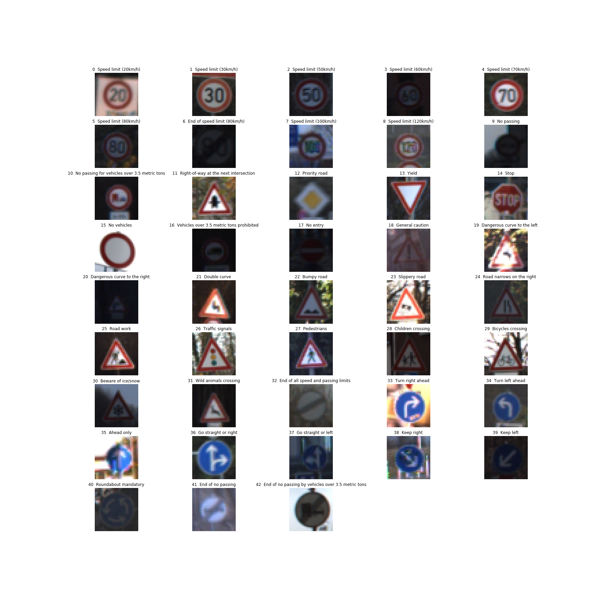
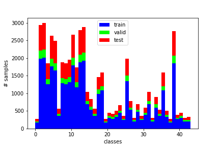
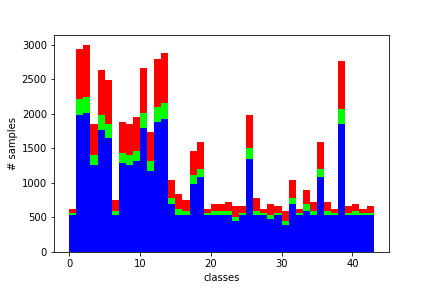
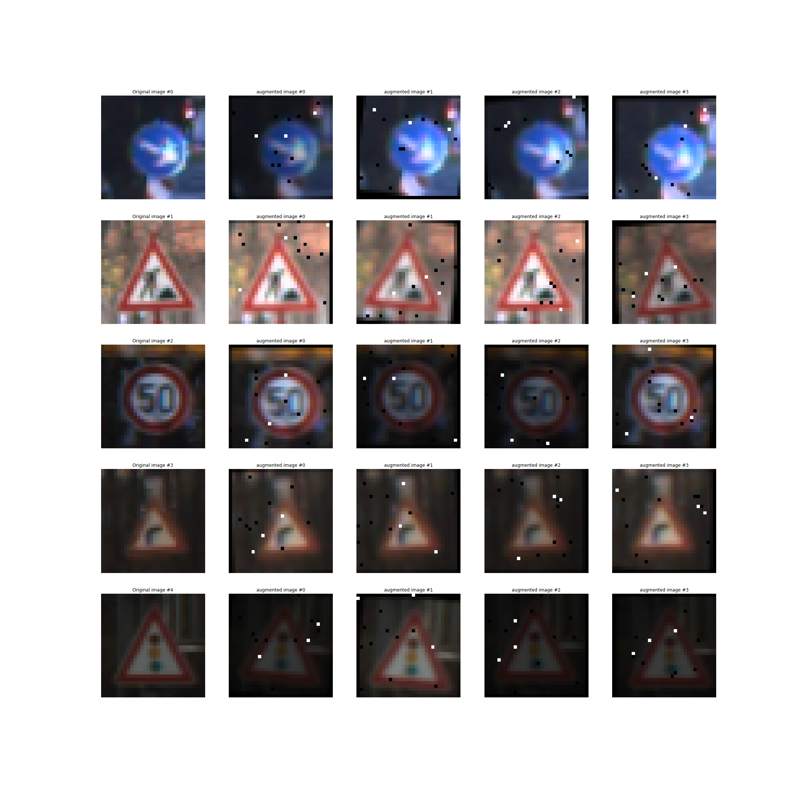
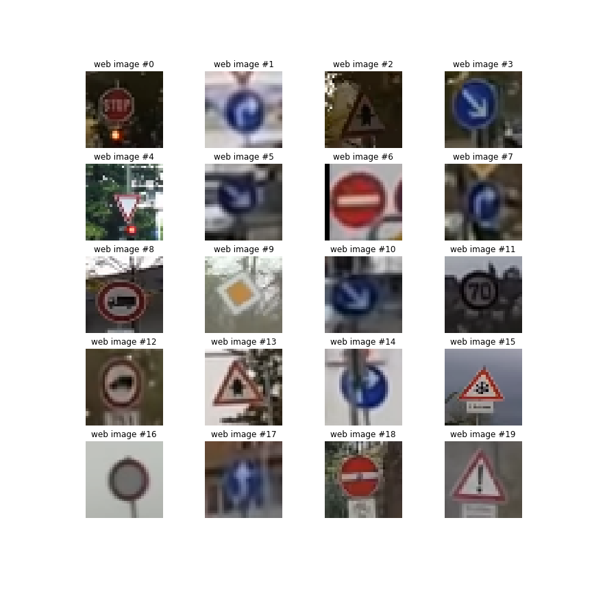
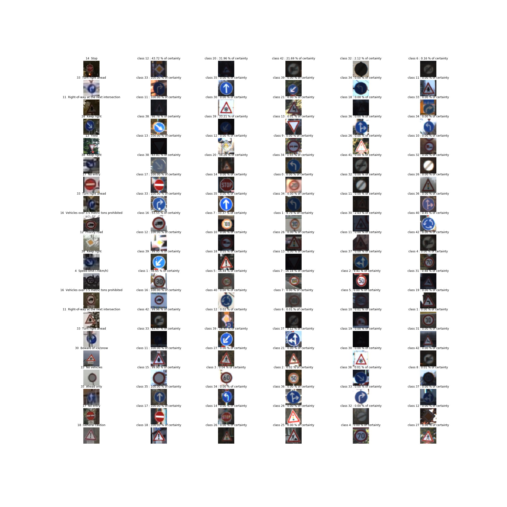

# **Traffic Sign Recognition** 

## Writeup

### You can use this file as a template for your writeup if you want to submit it as a markdown file, but feel free to use some other method and submit a pdf if you prefer.

---

**Build a Traffic Sign Recognition Project**

The goals / steps of this project are the following:
* Load the data set (see below for links to the project data set)
* Explore, summarize and visualize the data set
* Design, train and test a model architecture
* Use the model to make predictions on new images
* Analyze the softmax probabilities of the new images
* Summarize the results with a written report

## Rubric Points
### Here I will consider the [rubric points](https://review.udacity.com/#!/rubrics/481/view) individually and describe how I addressed each point in my implementation.  

---
### Writeup / README

#### 1. Provide a Writeup / README that includes all the rubric points and how you addressed each one. You can submit your writeup as markdown or pdf. You can use this template as a guide for writing the report. The submission includes the project code.

You're reading it! and here is a link to my [project code](Traffic_Sign_Classifier.ipynb)

### Data Set Summary & Exploration

#### 1. Provide a basic summary of the data set. In the code, the analysis should be done using python, numpy and/or pandas methods rather than hardcoding results manually.

I used the numpy library to calculate summary statistics of the traffic
signs data set and also used the set Class to get the number of unique classes and the len method of the list, to get the length of some Data:

The code can be seen in the third code cell of the [project code](Traffic_Sign_Classifier.ipynb)

* Number of training examples 34799
* The size of the validation set is 4410
* The size of test set is 12630
* The shape of a traffic sign image is (32, 32, 3)
* The number of unique classes/labels in the data set is 43

### Include an exploratory visualization of the dataset

Visualize the German Traffic Signs Dataset using the pickled file(s). This is open ended, suggestions include: plotting traffic sign images, plotting the count of each sign, etc. 

The [Matplotlib](http://matplotlib.org/) [examples](http://matplotlib.org/examples/index.html) and [gallery](http://matplotlib.org/gallery.html) pages are a great resource for doing visualizations in Python.

**NOTE:** It's recommended you start with something simple first. If you wish to do more, come back to it after you've completed the rest of the sections. It can be interesting to look at the distribution of classes in the training, validation and test set. Is the distribution the same? Are there more examples of some classes than others?

* First let's see one sample image of each class

* Then let's see the number of samples of each class and let's plot the distribution:

median value of train samples 540.0

number of training samples {0: 180, 1: 1980, 2: 2010, 3: 1260, 4: 1770, 5: 1650, 6: 360, 7: 1290, 8: 1260, 9: 1320, 10: 1800, 11: 1170, 12: 1890, 13: 1920, 14: 690, 15: 540, 16: 360, 17: 990, 18: 1080, 19: 180, 20: 300, 21: 270, 22: 330, 23: 450, 24: 240, 25: 1350, 26: 540, 27: 210, 28: 480, 29: 240, 30: 390, 31: 690, 32: 210, 33: 599, 34: 360, 35: 1080, 36: 330, 37: 180, 38: 1860, 39: 270, 40: 300, 41: 210, 42: 210}

number of validation samples {0: 30, 1: 240, 2: 240, 3: 150, 4: 210, 5: 210, 6: 60, 7: 150, 8: 150, 9: 150, 10: 210, 11: 150, 12: 210, 13: 240, 14: 90, 15: 90, 16: 60, 17: 120, 18: 120, 19: 30, 20: 60, 21: 60, 22: 60, 23: 60, 24: 30, 25: 150, 26: 60, 27: 30, 28: 60, 29: 30, 30: 60, 31: 90, 32: 30, 33: 90, 34: 60, 35: 120, 36: 60, 37: 30, 38: 210, 39: 30, 40: 60, 41: 30, 42: 30}

number of test samples {0: 60, 1: 720, 2: 750, 3: 450, 4: 660, 5: 630, 6: 150, 7: 450, 8: 450, 9: 480, 10: 660, 11: 420, 12: 690, 13: 720, 14: 270, 15: 210, 16: 150, 17: 360, 18: 390, 19: 60, 20: 90, 21: 90, 22: 120, 23: 150, 24: 90, 25: 480, 26: 180, 27: 60, 28: 150, 29: 90, 30: 150, 31: 270, 32: 60, 33: 210, 34: 120, 35: 390, 36: 120, 37: 60, 38: 690, 39: 90, 40: 90, 41: 60, 42: 90}

From the above image it's remarkable that almost half of the classes have less than 300 training samples, but the median value of the number of samples per class is 540, so it would be interesting to consider augment the data until reach or being close to the median value. 

## This is the distribution of the classes after the data augmentation that is discussed below.

### Design and Test a Model Architecture

#### 1. Describe how you preprocessed the image data. What techniques were chosen and why did you choose these techniques? Consider including images showing the output of each preprocessing technique. Pre-processing refers to techniques such as converting to grayscale, normalization, etc. (OPTIONAL: As described in the "Stand Out Suggestions" part of the rubric, if you generated additional data for training, describe why you decided to generate additional data, how you generated the data, and provide example images of the additional data. Then describe the characteristics of the augmented training set like number of images in the set, number of images for each class, etc.)

From the histogram above it's observable that there are some classes with few samples for the training, so the function augmentation_required(histogram,percentage_under=0.7) returns a dict the Ids of the classes that are under percentage_under*median_value, which require augmentation, and the value of each key is the number of samples that need to be added to that class.

This is the output of the function for the train dataset:

class id : # new samples required
{0: 360, 6: 180, 16: 180, 19: 360, 20: 240, 21: 270, 22: 210, 24: 300, 27: 330, 29: 300, 32: 330, 34: 180, 36: 210, 37: 360, 39: 270, 40: 240, 41: 330, 42: 330}

The conclusion is that 4980 images from data augmentation are required in the train set.

### Function to augment an Image 

A search was made on the web, to find the best functions to create some new samples from an image.

In this notebook the affine transformation are described.
https://github.com/vxy10/ImageAugmentation/blob/master/img_transform_NB.ipynb

Here is a tutorial about de importance of brightness augmentation.
https://www.kaggle.com/chris471/basic-brightness-augmentation

<b>The approach to augment the data was to apply random translation and rotation transformations to the image, then a brightness augmentation and finally some random white and black points were added with the function add_salt_pepper_noise()</b>

The transform image() function in the third code block after the title "Step 2: Design and Test a Model Architecture" is the function that returns an augmented image from an image of the dataset. Below there are some examples of the output of this function where it's observable that the generated images have random translation,rotation,changes of brightness and also salt and pepper noise.

* After having the full dataset, the next step was normalizing the data to the range (-1,1) - This was done using the line of code X_train_normalized = (X_train - 128)/128. The resulting dataset mean is close to 0. I chose this because it's really easy to implement and works.  

* Grayscale transformation was not implemented to take advantage of the differences between the red, blue and yellow traffic signs.

#### 2. Describe what your final model architecture looks like including model type, layers, layer sizes, connectivity, etc.) Consider including a diagram and/or table describing the final model.

The model architecture was mostly inspired on the LeNet, but I took the decision of including the 3 input channels, I also duplicate the output channels of the first and second convolution filters and the number of outputs of the first fully connected layer. The values modified are in bold

My final model consisted of the following layers:

| Layer         		|     Description	        					| 
|:---------------------:|:---------------------------------------------:| 
| Input         		| 32x32x<b>3</b> RGB image   							| 
| Convolution 5x5     	| 1x1 stride, valid padding, outputs 28x28x<b>12</b>   |
| RELU					|												|
| Max pooling	      	| 2x2 stride, valid padding  outputs 14x14x<b>12</b> 				|
| Convolution 5x5	    | 1x1 stride, valid padding, outputs 10x10x<b>32</b>   |
| RELU					|												|
| Max pooling	      	| 2x2 stride, valid padding  outputs 5x5x<b>32</b> 				|
| Fully connected		| input <b>800</b>  output <b>200</b>       									|
| RELU					|												|
|<b>Dropout</b> 	    |	keep : 0.6											|
| Fully connected		| input <b>200</b>  output 84      									|
| RELU					|												|
| Fully connected		| input <b>84</b>  output 43 Logits      									|

#### 3. Describe how you trained your model. The discussion can include the type of optimizer, the batch size, number of epochs and any hyperparameters such as learning rate.

To train the model, I used the cross entropy loss function and Adam optimizer which is a combination of AdaGrad and RMSProp which compute a combination of the first and second "momentum" of the gradients.

These are the final hyperparameters chosen to train the network:

* rate = 0.0008
* EPOCHS = 55
* BATCH_SIZE = 128
* keep_units (dropout) =  60%

The process to find the final parameters is described below.

#### 4. Describe the approach taken for finding a solution and getting the validation set accuracy to be at least 0.93. Include in the discussion the results on the training, validation and test sets and where in the code these were calculated. Your approach may have been an iterative process, in which case, outline the steps you took to get to the final solution and why you chose those steps. Perhaps your solution involved an already well known implementation or architecture. In this case, discuss why you think the architecture is suitable for the current problem.

My final model results were:
* training set accuracy of 100%
* validation set accuracy of 97.7%
* test set accuracy of 95.6%

If an iterative approach was chosen:
* What was the first architecture that was tried and why was it chosen? ANSWER: The first architecture that I tried was the well known LeNet-5, I chose that because I had programmed this before, so it was easy to implement.

* What were some problems with the initial architecture? ANSWER: First, it had a huge difference on performance on the train and valid data. Second, it didn't reach the 93% of accuracy in the training and validation datasets.

* How was the architecture adjusted and why was it adjusted? ANSWER: Initially I included a dropout (keep 60% neurons) layer after the first and second fully connected layer, which had the major quantity of output neurons, this was done to avoid the overfitting and it worked well, there's a little bit of overfitting, but the networks seems to work well on new data. Then, to improve the accuracy of the model I chose to duplicate the output channels of the two convolutional layers, and to increase the number of outputs of the first fully connected to 200 neurons. 

* Which parameters were tuned? How were they adjusted and why? ANSWER: The learning rate, the number of epochs and the batch size were tuned. The process to tune this parameters was not standarized. The default value for the learning rate of 0.001 seems to overshoot the local minima, so I changed it to 0.0008 and it showed a smooth step now.The number of epochs was augmented to 55 because with epochs = 40 the behavior was not asymptotic yet. The batch size was set to 128, because with batch_size=64 the oscilations in the acuraccy values beetween epochs were higher and with 128, the value of the validation acuraccy tended to increase faster.

* What are some of the important design choices and why were they chosen? For example, why might a convolution layer work well with this problem? ANSWER: the convolutional layer might work well because it's highly recomended for images, because its layers start recognizing the low level features of an image and then combines them to locate the high level feautures. Another good decision was to remove shear transformation in the data augmentation step, the validation acuraccy was better after the change. How might a dropout layer help with creating a successful model? The dropout layers decreased the overfitting a lot, forcing the network not to trust a single neuron.

| Acuraccy on validation       		|     Description	        					| 
|:---------------------:|:---------------------------------------------:| 
| 0.949             |rate = 0.0009  EPOCHS = 40  BATCH_SIZE = 64					| 
| 0.969    	        |rate = 0.0009  EPOCHS =50  BATCH_SIZE = 128    |
| 0.960				|rate = 0.0009  EPOCHS =50  BATCH_SIZE = 128 +Data augmentation (translate,shear,rotation)|
| 0.977        |rate=0.0008 EPOCHS=55 BATCH_SIZE=128 +Data augmentation (translate,rotation,bright,saltPepper)               |

### Test a Model on New Images

#### 1. Choose five German traffic signs found on the web and provide them in the report. For each image, discuss what quality or qualities might be difficult to classify.

Here are twenty German traffic signs that I found on the web:

.

I will talk about the five images that I consider the most difficult to classify: 

* Image #0 might be difficult to classify because the brightness and the contrast of the image is not really good, it could fool the classifier.

* Image #4 would be really difficult to classify because the traffic sign is small in the picture.

* Image #14, it would be surprising if the network classifies this image right, because it's really ocluded.

* Image #15 has a difficult angle, and also looks similar to the traffic sign in the image #13.

* Image #17 is difficult to classify even for a human because it's really blurry and confusing.

I would say that all the other images would be easy to classify for a well trained network

#### 2. Discuss the model's predictions on these new traffic signs and compare the results to predicting on the test set. At a minimum, discuss what the predictions were, the accuracy on these new predictions, and compare the accuracy to the accuracy on the test set (OPTIONAL: Discuss the results in more detail as described in the "Stand Out Suggestions" part of the rubric).

The model accuracy on the web images was 75%, the image showing the predictions of the network vs the actual input is shown in the #3 below.

The model was able to correctly guess 15 of the 20 traffic signs, which gives an accuracy of 75%. This is less than the accuracy on the test set 95%.

It could be due to:

* Some web images was taken to intentionally fool the classifier.
* Almost all web images are taken from further away and contain more information of the surroundings of the signal.
* The resolution of the test images is better, maybe because the web images was taken from a low quality video on youtube.

#### 3. Describe how certain the model is when predicting on each of the five new images by looking at the softmax probabilities for each prediction. Provide the top 5 softmax probabilities for each image along with the sign type of each probability. (OPTIONAL: as described in the "Stand Out Suggestions" part of the rubric, visualizations can also be provided such as bar charts)

The code for making predictions on my final model is located at the end of the Ipython notebook.

For the image #0 (Stop sign), the model is not sure of the class, none of the five guesses include the stop sign. This image really fooled the classifier.

| Probability         	|     Prediction	        					| 
|:---------------------:|:---------------------------------------------:| 
| .4372         			| Priority road  									| 
| .3196    				| Dangerous curve to the right										|
| .2169					| End of no passing by vehicles over 3.5				|
| .0212	      			| End of all spped and passing limits		 				|
| .0016				    | End of speed limit 80kmh     							|

For the second image #17 (Yield), the model is 100% sure that it is a (Yield sign) even when the picture has not a good perspective angle.

| Probability         	|     Prediction	        					| 
|:---------------------:|:---------------------------------------------:| 
| 1       			| Yield 									| 
| 0    				| Priority road										|
| 0					| No passing										|
| 0	      			| Traffic signals					 				|
| 0				    | No passing for vehicles over 3.5 metric tons    	|

For the third image #14 (Turn right ahead), the model is 83.47% sure of the class, it was a difficult prediction because the complexity of the image

| Probability         	|     Prediction	        					| 
|:---------------------:|:---------------------------------------------:| 
| 0.8347        		| Turn right ahead  									| 
| 0.1640  				| Ahead only 										|
| 0.012				| Turn left ahead 										|
| 0.0      			| right of away at the next intersection					|
| 0.0				    | Go straight or right      							|

For the fourth image #15 (beware of ice), the model fails it's 99.9999% sure that it's a "right of away at the next intersection" and the right class is on the fourth guess with just 0.00001%

| Probability         	|     Prediction	        					| 
|:---------------------:|:---------------------------------------------:| 
| 1.0     		| right of away at the next intersection  									| 
| 0.0     				| Pedestrians										|
| 0.0					| Double curve										|
| 0.0	      			| Beware of ice/snow					 				|
| 0.0				    | End of no passing by vehicles over 3.5 metric tons   		|

For the fifth image #15 (Ahead only), the model is 100% sure that it's an "Ahead only" sign
it's interesting to see the top 5 guessses because all of them are blue signs, so the convolutional filter on the rgb channels seems to work well. 

| Probability         	|     Prediction	        					| 
|:---------------------:|:---------------------------------------------:| 
| 1.0      		| Ahead only 									| 
| 0.0     				| Turn left ahead									|
| 0.0					| Go straight or right										|
| 0.0	      			| Turn right ahead					 				|
| 0.0				    | Go straight or left     							|

Finally in the last code block the accuracy to predict the actual image on the top 5 guesses is calculated. The result is 80% showing that the performance of the network on these web images is not so good as the performance on the test images, maybe it could suggest to change the network in order to generalize better on difficult and blured images.

Something to improve in the future is that the model is really sure of its predictions almost all the time, even when it's wrong

.

